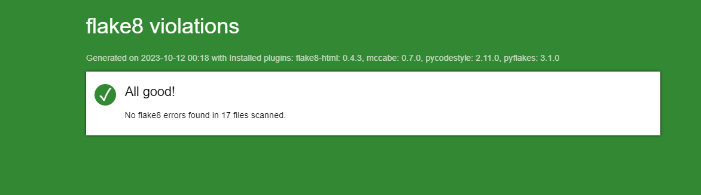
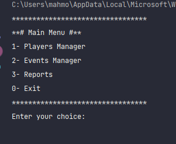
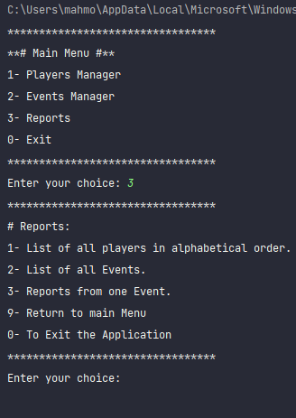
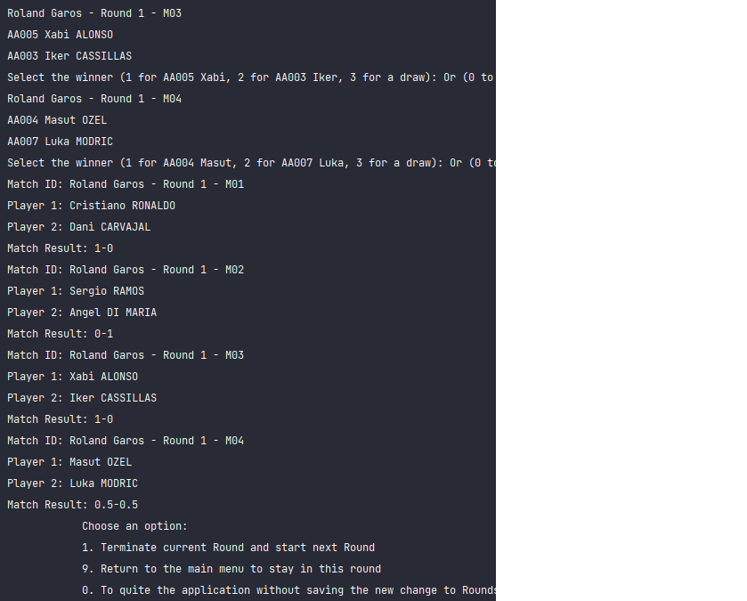
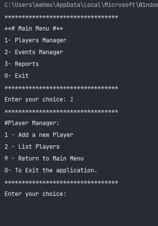
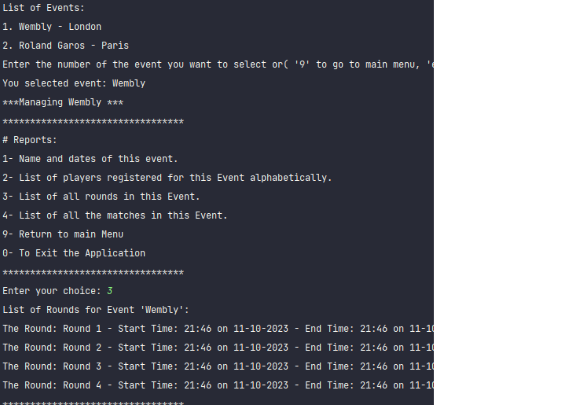

# Project 4 Chess-Tournament Python (Mahmoud ALHIJJIRI) 

---------

***OpenClassrooms Develops a software program in Python Project 4 deliverable: 
chess Event management application with database.***

_Tested on Windows 10 - Python version 3.11.3_

---------

## Table of Contents
1. [Project initialization](#id-section1)
    1. [Windows](#id-section1-1)
    2. [MacOS and Linux](#id-section1-2)
    3. [Generate a flake8 report](#id-section1-3)
2. [Menu Options](#id-section2)
    1. [Players Manager](#id-section2-1)
    2. [Events Manager](#id-section2-2)
3. [Reports](#id-section3)

## 1. Project Initiation

---------

#### i. Windows :

In Windows Powershell, navigate to the desired folder.

###### Project Recovery

        $ github.com/motive007/OpenClassRoom_P4_Developpez_un_programme_logiciel_en_Python.git

##### Enable Virtual Environment
    $ cd P4-Chess-Tournament-Alhijjiri-Mahmoud
    $ python -m venv env 
    $ env\scripts\activate
    # In cmd.exe
    venv\Scripts\activate.bat
    # In PowerShell
    venv\Scripts\Activate.ps1
   
###### Install the required packages
    $ pip install -r requirements.txt

###### Launch the program
    $ python main.py

---------
#### ii. MacOS and Linux :
In the terminal, navigate to the desired folder.

###### Project Recovery
    $ git clone https://github.com/motive007/OpenClassRoom_P4_Developpez_un_programme_logiciel_en_Python

###### Enable Virtual Environment
    $ cd P4-Chess-Tournament-Alhijjiri-Mahmoud
    $ python3 -m venv env 
    $ source env/bin/activate

###### Install the required packages
    $ pip install -r requirements.txt

###### Launch the program
    $ python3 main.py

----------

#### iii. Generate a flake8 report

    $ flake8 --format=html --htmldir=flake8_report

**You will find the report in the _'flake8-report' folder.**

_Last exported report:_

----------

## 2. Menu options

----------

#### i. Menu Principal

----------

#### ii. Reports Menu

----------

## 3. display examples
#### Round Games:

----------

#### Report players :

----------

#### Round Report :
